# 03. ドメインモデル（ドラフト）

- **ドキュメント種別**: 上流工程 / ドメインモデル（概念モデル・ER・状態遷移）
- **対象システム（仮称）**: 居酒屋店舗システム（SaaS型） ／ AIネイティブ再構築版
- **作成日**: 2026-09-03
- **ステータス**: ドラフト（レビュー用）
- **関連文書**: `01_system_overview.md`、`02_requirements.md`（本書は 02 のフェーズ1要件に基づく）

> 本書はフェーズ1の要件（`02_requirements.md` 第5章 FR-A〜FR-K、および第2.5節の決定事項）に基づいて、
> 主要エンティティ、ER図（Mermaid）、主要な状態遷移（Mermaid）を定義する。
> 物理テーブル定義・カラム型・インデックス・API は `04_architecture.md` で確定する。
>
> **Mermaid 記法について**: 本書の図は ```mermaid フェンスで記述している。GitHub / VS Code /
> Mermaid 対応ビューアでは図として表示される。pandoc + wkhtmltopdf での PDF 化ではコードのまま
> 出力されるため、PDF に図を含めたい場合は Mermaid のプリレンダリングが必要（`04` で方針を決める）。

---

## 1. モデリング方針（`02` 2.5 の決定を反映）

| # | 方針 | 根拠 |
|---|------|------|
| 1 | **マルチテナント**：全業務テーブルはテナント識別子 `company_code` を持つ（共有DB・共有スキーマ）。アプリ層で必ずテナント境界を強制する。 | 2.5 マルチテナント分離、FR-A06 |
| 2 | **店舗スコープ**：全業務テーブルは `store_id` を持つ。フェーズ1は「1テナント1店舗」だが、構造は複数店舗前提。 | 2.5 店舗数、NFR-07 |
| 3 | **金額は整数（円）**。`amount_jpy` のように単位を明示。丸め規則は税計算で定義（`04`）。 | DAT-03 |
| 4 | **価格・名称はスナップショット**：注文明細・会計明細は、その時点のメニュー名・単価・税区分を複製して保持する（後からメニューを変えても過去伝票は不変）。 | FR-K01、FR-D01 |
| 5 | **確定後は不変・訂正はイベント**：会計確定後の修正は「返金」、日次締め後の修正は「翌営業日の補正」。元レコードは削除しない。 | FR-G10、FR-H01 |
| 6 | **イベントの記録**：卓・注文明細・会計の状態変化を時刻付きイベントとして `domain_event` に残す（分析・AI の後付けのため）。 | FR-K02 |
| 7 | **監査ログ**：重要操作は `audit_log` に追記専用で記録。業務テーブルとは分離。 | FR-J01〜J05 |
| 8 | **論理削除**：マスタ（メニュー、卓、スタッフ等）は物理削除せず `is_active` で無効化（過去伝票の参照整合のため）。 | FR-K01 |
| 9 | **共通監査項目**：全テーブルに `created_at` / `updated_at`、業務テーブルに `created_by` / `updated_by`（既存 `BaseEntity` を踏襲・拡張）。 | 既存実装 |
| 10 | **長期保持**：取引・帳簿系（注文明細、会計、決済、返金、日次締め、`domain_event`）は長期保持前提（7〜10年目安、確定は法務）。 | 2.5 データ保持方針、DAT-04 |

---

## 2. 主要エンティティ一覧（フェーズ1）

区分の凡例：`M`=フェーズ1で必須、`S`=可能なら（難ければフェーズ2）、`(基盤)`=分析・AIの後付け用。

属性名は物理カラム名（英字 `snake_case`、方針 #6・第6章）を正とし、意味が分かりにくい語には `属性名`（和名） の形で日本語を併記する（`id` / `name` / `created_at` 等の自明な語は併記しない）。

### 2.1 テナント・組織・ユーザー

| エンティティ | 区分 | 目的 | 主な属性（代表） |
|--------------|:--:|------|------------------|
| `company`（テナント） | M | 契約単位。1オーナー＝1テナント | `id`, `company_code`（テナント識別子, UK）, `name`, `contract_status`（契約状態）, `created_at` |
| `store`（店舗） | M | 営業拠点。全業務データのスコープ | `id`, `company_id`（テナント識別子, FK）, `name`, `address`, `phone`, `business_hours`（営業時間）, `seat_count`（座席数）, `timezone`（タイムゾーン）, `is_active`（有効フラグ） |
| `store_setting`（店舗設定） | M | 税・予約・モバイルオーダー等の店舗ポリシー（`store` と 1:1） | `store_id`, `tax_rounding`（税額丸め規則）, `price_includes_tax`（税込価格か）, `invoice_reg_no`（適格請求書登録番号）, `web_reservation_mode`（Web予約受付方式, APPROVAL/INSTANT）, `mobile_order_enabled`（モバイルオーダー有効）, `last_order_default_min`（ラストオーダー既定, 分）, `cancel_charge_default_customer`（客都合キャンセルの既定課金, bool）, `cancel_charge_default_store`（店都合キャンセルの既定課金, bool） |
| `user`（利用者） | M | ログインユーザー。既存 `users` を継承（`company_id + email` 複合UK） | `id`, `company_id`（テナント識別子, FK）, `store_id`（所属店舗, nullable=全店）, `name`, `email`, `password`(hash), `telnumber`（電話番号）, `role`（権限ロール, OWNER/MANAGER/HALL/KITCHEN/PARTTIME）, `status`（アカウント状態, ACTIVE/LOCKED/INVITED）, `two_factor_enabled`（2要素認証有効） |
| `user_invitation`（招待） | M | 招待リンクの発行・失効 | `id`, `company_id`（テナント識別子, FK）, `store_id`, `email`, `role`, `token`（招待トークン）, `expires_at`（有効期限）, `accepted_at`（受諾日時） |

> `company` を新設し `id`（サロゲートキー）を主キーとする。`company` から1ホップの直下テーブル
> （`store`・`user`・`user_invitation`）は実FKの `company_id` を持つ（詳細は第7章1・`04_architecture.md`）。
> それ以外の業務テーブルは、テナント絞り込み用に `company_code` 列（FK制約なしの非正規化コピー）を保持する。

### 2.2 マスタ（メニュー・卓・コース・決済手段）

| エンティティ | 区分 | 目的 | 主な属性（代表） |
|--------------|:--:|------|------------------|
| `menu_category`（メニューカテゴリ） | M | 刺身／揚げ物／ドリンク 等 | `id`, `store_id`, `name`, `display_order`（表示順）, `is_active`（有効フラグ） |
| `menu_item`（メニュー項目） | M | 品目 | `id`, `store_id`, `category_id`, `name`, `description`, `price_jpy`（単価, 円）, `tax_category`（税区分, STANDARD_10/REDUCED_8）, `photo_url`, `serve_time_from`（提供時間帯 開始）, `serve_time_to`（提供時間帯 終了）, `available_from`（提供期間 開始）, `available_to`（提供期間 終了, 期間限定）, `sales_status`（販売状態, ON_SALE/SOLD_OUT/SUSPENDED）, `display_order`（表示順）, `is_active`（有効フラグ） |
| `menu_option_group`（オプション群） | S | 「サイズ」「トッピング」等 | `id`, `store_id`, `menu_item_id`(または共有), `name`, `min_select`（最小選択数）, `max_select`（最大選択数） |
| `menu_option`（オプション） | S | 「大盛り +150円」等 | `id`, `option_group_id`, `name`, `price_delta_jpy`（追加料金, 円）, `is_active`（有効フラグ） |
| `course`（コース・飲み放題） | S | 時間管理の対象 | `id`, `store_id`, `name`, `type`（種別, COURSE/FREE_DRINK）, `duration_min`（制限時間, 分）, `last_order_before_min`（終了前ラストオーダー, 分）, `price_jpy`（料金, 円）, `is_active`（有効フラグ） |
| `dining_table`（卓） | M | 客席。モバイルオーダーのQR紐付け先 | `id`, `store_id`, `table_no`（卓番号）, `seat_count`（座席数）, `area`（エリア）, `qr_token`（QRトークン, 店内UK）, `status`（卓状態, EMPTY/OCCUPIED/BILLING＝一覧表示用の導出値）, `is_active`（有効フラグ） |
| `payment_method_config`（決済手段設定） | M | 店舗が有効化した決済手段 | `id`, `store_id`, `method_type`（決済手段種別, CASH/PAYPAY/CREDIT_CARD/RAKUTEN_PAY）, `enabled`（有効）, `display_name`（表示名）, `credential_enc`（認証情報, 暗号化。CASH/RAKUTEN_PAYは空可）, `note` |
| `store_business_day`（営業日設定） | M | 営業日／臨時休業。Web予約受付可否に反映 | `id`, `store_id`, `date`or`weekday`（日付 or 曜日）, `is_open`（営業するか）, `open_time`（開店時刻）, `close_time`（閉店時刻）, `reservation_capacity`（予約受入可能数） |

### 2.3 予約

| エンティティ | 区分 | 目的 | 主な属性（代表） |
|--------------|:--:|------|------------------|
| `reservation`（予約） | M | 電話／Web／当日ウォークインを一元管理 | `id`, `store_id`, `reserved_at`（予約日時）, `party_size`（人数）, `guest_name`, `guest_phone`, `guest_email`, `request_note`(アレルギー等), `course_id`(nullable), `channel`（予約経路, WEB/PHONE/WALK_IN）, `status`（予約状態, REQUESTED/CONFIRMED/SEATED/DONE/CANCELLED/NO_SHOW）, `created_by`(nullable=Web), `confirmed_by`（確定者）, `confirmed_at`（確定日時）, `cancelled_reason`（キャンセル理由） |
| `reservation_notification`（予約通知） | M | 受付確認・前日リマインドの送信記録 | `id`, `reservation_id`, `type`（通知種別, CONFIRM/REMINDER）, `channel`（送信手段, EMAIL/SMS）, `to`（宛先）, `status`（送信状態, QUEUED/SENT/FAILED）, `sent_at`（送信日時） |

### 2.4 来店・卓セッション・注文

| エンティティ | 区分 | 目的 | 主な属性（代表） |
|--------------|:--:|------|------------------|
| `table_session`（卓セッション＝来店） | M | 卓のオープンからクローズまでの一連の飲食 | `id`, `store_id`, `status`（セッション状態, OPEN/BILLING/CLOSED）, `opened_at`（開始日時）, `opened_by`（開始操作者）, `closed_at`（終了日時）, `party_size`（人数）, `reservation_id`(nullable), `course_id`(nullable), `course_started_at`（コース開始日時）, `last_order_at`（ラストオーダー時刻） |
| `table_session_table`（セッション⇔卓） | S | 卓の結合。1セッションが複数卓を占有 | `table_session_id`, `dining_table_id`, `is_primary`（主卓か） |
| `mobile_order_session`（モバイルオーダーセッション） | M | 卓上QRから開く未ログインの注文セッション | `id`, `table_session_id`, `qr_token`（QRトークン）, `issued_at`（発行日時）, `expires_at`（有効期限）, `status`(ACTIVE/EXPIRED)（卓クローズで EXPIRED） |
| `order`（注文＝1回の送信） | M | スタッフ入力 or モバイル送信の単位 | `id`, `table_session_id`, `dining_table_id`（注文時点の物理卓, FK→`dining_table`）, `source`（注文元, STAFF/MOBILE）, `entered_by`（入力者, user, nullable）, `mobile_order_session_id`(nullable), `status`（注文状態, SUBMITTED/ACCEPTED/REJECTED）, `submitted_at`（送信日時）, `accepted_by`（受理者）, `accepted_at`（受理日時）, `reject_reason`（却下理由） |
| `order_line`（注文明細） | M | 品目単位。分析の最小粒度 | `id`, `order_id`, `table_session_id`, `menu_item_id`, `item_name_snap`（品名スナップショット）, `unit_price_snap_jpy`（単価スナップショット, 円）, `tax_category_snap`（税区分スナップショット）, `quantity`（数量）, `note`, `serve_status`（提供状態, PENDING/PREPARING/SERVED/CANCELLED/REJECTED）, `registered_at`（登録日時）, `registered_by`（登録者）, `served_at`（提供日時）, `cancelled_at`（取消日時）, `cancelled_by`（取消者）, `cancel_reason`（取消理由, ORDER_MISTAKE/QUALITY/DELAY/WRONG_SERVE/SOLD_OUT/CUSTOMER/OTHER）, `cancel_chargeable`（課金対象か, bool）, `was_cooked`(bool＝廃棄ロス判定), `remake_of_line_id`（作り直し元明細, self, nullable） |
| `order_line_option`（明細オプション） | S | 明細に付いたオプションのスナップショット | `id`, `order_line_id`, `option_name_snap`（オプション名スナップショット）, `price_delta_snap_jpy`（追加料金スナップショット, 円） |
| `kitchen_ticket`（キッチン伝票） | M | KDS 表示・提供管理の単位 | `id`, `order_id`, `store_id`, `status`（調理状態, NEW/IN_PROGRESS/DONE）, `printed_at`（印刷日時）, `updated_at` |

### 2.5 会計・決済

| エンティティ | 区分 | 目的 | 主な属性（代表） |
|--------------|:--:|------|------------------|
| `check`（会計＝チェック） | M | 1卓の精算単位。別会計で複数可 | `id`, `table_session_id`, `store_id`, `seq_in_session`（セッション内連番）, `status`（会計状態, OPEN/FINALIZED/VOIDED）, `subtotal_jpy`（小計, 円）, `discount_total_jpy`（割引合計, 円）, `tax_total_jpy`（税合計, 円）, `total_jpy`（合計, 円）, `split_type`（分割方式, NONE/BY_HEAD/BY_ITEM）, `split_count`（分割数）, `finalized_at`（確定日時）, `finalized_by`（確定者）, `business_date`（営業日） |
| `check_line`（会計明細） | M | どの注文明細をこの会計に割り当てたか（別会計対応） | `id`, `check_id`, `order_line_id`, `amount_jpy`（金額, スナップショット, 円）, `quantity`（数量） |
| `check_discount`（割引・クーポン） | M | 値引き・クーポン・端数調整 | `id`, `check_id`, `type`（割引種別, AMOUNT/RATE/COUPON/ROUNDING）, `value`（割引値, 金額 or 率）, `amount_jpy`（割引額, 円）, `reason`（理由）, `applied_by`（適用者）, `applied_at`（適用日時） |
| `check_tax_line`（税区分別内訳） | M | 適格請求書の税率別対価・消費税額 | `id`, `check_id`, `tax_category`（税区分, STANDARD_10/REDUCED_8）, `taxable_amount_jpy`（対象額, 円）, `tax_amount_jpy`（消費税額, 円） |
| `payment`（決済明細） | M | 混合支払い対応（1会計に複数） | `id`, `check_id`, `method_type`（決済手段, CASH/PAYPAY/CREDIT_CARD/RAKUTEN_PAY）, `amount_jpy`（決済額, 円）, `status`（決済状態, SUCCESS/FAILED/PENDING）, `external_txn_id`（外部取引ID, nullable）, `tendered_jpy`（預り金）/`change_jpy`（釣り銭）(現金), `is_manual_entry`(bool＝楽天ペイ等), `processed_at`（処理日時）, `processed_by`（処理者） |
| `refund`（返金イベント） | M | 会計確定後の訂正。元会計は保持 | `id`, `check_id`, `payment_id`(nullable), `amount_jpy`（返金額, 円）, `reason`（返金理由区分）, `reason_note`（理由備考）, `executed_by`（実行者）, `executed_at`（実行日時）, `approved_by`（承認者, nullable） |
| `receipt`（レシート／領収書） | M | 発行記録。フェーズ1は PDF | `id`, `check_id`, `type`（帳票種別, RECEIPT/INVOICE）, `addressee`（宛名）, `proviso`（但し書き）, `issued_at`（発行日時）, `pdf_ref`（PDF参照）, `invoice_reg_no_snap`（登録番号スナップショット）, `tax_lines_snap`（税区分別内訳スナップショット, JSON） |

### 2.6 日次締め・売上日報

| エンティティ | 区分 | 目的 | 主な属性（代表） |
|--------------|:--:|------|------------------|
| `daily_close`（日次締め） | M | 営業日の売上確定・レジ点検 | `id`, `store_id`, `business_date`（営業日）, `status`（締め状態, OPEN/CLOSED）, `closed_by`（実行者）, `closed_at`（実行日時）, `cash_counted_jpy`（現金実査額, 円）, `cash_theoretical_jpy`（現金理論額, 円）, `cash_diff_jpy`（過不足, 円） |
| `sales_daily_report`（売上日報） | M | 締めにより自動生成 | `id`, `daily_close_id`, `store_id`, `business_date`（営業日）, `sales_total_jpy`（売上合計, 円）, `guest_count`（客数）, `group_count`（組数）, `avg_per_guest_jpy`（客単価, 円）, `discount_total_jpy`（割引合計, 円）, `refund_total_jpy`（返金合計, 円） |
| `sales_report_by_payment`（手段別内訳） | M | 日報の明細 | `id`, `sales_daily_report_id`, `method_type`（決済手段）, `amount_jpy`（金額, 円）, `txn_count`（取引件数） |
| `sales_report_by_tax`（税区分別内訳） | M | 日報の明細 | `id`, `sales_daily_report_id`, `tax_category`（税区分）, `sales_amount_jpy`（売上額, 円）, `tax_amount_jpy`（消費税額, 円） |
| `sales_report_by_hour`（時間帯別） | M | 1時間単位 | `id`, `sales_daily_report_id`, `hour`（時刻, 0–23）, `sales_amount_jpy`（売上額, 円）, `guest_count`（客数） |

### 2.7 スタッフ・シフト・勤怠

| エンティティ | 区分 | 目的 | 主な属性（代表） |
|--------------|:--:|------|------------------|
| `staff`（スタッフ） | M | 人事情報。`user` と 0..1:1 | `id`, `store_id`, `user_id`(nullable), `name`, `role`（役割）, `hourly_wage_jpy`（時給, 円）, `contact`（連絡先）, `is_active`（有効フラグ） |
| `staff_availability`（勤務可能時間） | M | 曜日・時間帯 | `id`, `staff_id`, `weekday`（曜日）, `start_time`（開始時刻）, `end_time`（終了時刻） |
| `shift_request`（シフト希望） | M | スタッフの希望提出 | `id`, `staff_id`, `target_date`（対象日）, `type`（希望種別, AVAILABLE/UNAVAILABLE）, `start_time`（開始時刻）, `end_time`（終了時刻）, `comment`, `submitted_at`（提出日時） |
| `shift_schedule`（シフト表） | M | 週単位。作成→公開 | `id`, `store_id`, `period_start`（期間開始）, `period_end`（期間終了）, `status`（シフト表状態, DRAFT/PUBLISHED）, `published_at`（公開日時）, `created_by` |
| `shift_assignment`（シフト割当） | M | 1名の1日の勤務枠 | `id`, `shift_schedule_id`, `staff_id`, `work_date`（勤務日）, `start_time`（開始時刻）, `end_time`（終了時刻）, `position`（担当ポジション） |
| `time_clock`（打刻） | M | 出退勤 | `id`, `staff_id`, `store_id`, `work_date`（勤務日）, `clock_in_at`（出勤打刻）, `clock_out_at`（退勤打刻）, `is_corrected`（打刻修正済み）, `corrected_by`（修正者）, `correction_note`（修正理由） |

### 2.8 監査・イベント・通知（基盤）

| エンティティ | 区分 | 目的 | 主な属性（代表） |
|--------------|:--:|------|------------------|
| `audit_log`（監査ログ） | M | 重要操作の追記専用証跡 | `id`, `company_code`（テナント識別子）, `store_id`, `actor`（操作者, user_id or SYSTEM）, `action`（操作種別, LOGIN/PERMISSION_CHANGE/PAYMENT_SETTING_CHANGE/MENU_PRICE_CHANGE/ORDER_LINE_CANCEL_AFTER_SERVE/CHECK_FINALIZE/CHECK_VOID/REFUND/DISCOUNT/DAILY_CLOSE/TIMECLOCK_EDIT/DATA_EXPORT/...）, `target_type`（対象種別）, `target_id`（対象ID）, `before_summary`（変更前サマリ）, `after_summary`（変更後サマリ）, `ip`, `device`, `occurred_at`（発生日時） |
| `domain_event`（ドメインイベント） | (基盤) | 状態変化の時刻付き記録（分析・AI後付け用） | `id`, `company_code`（テナント識別子）, `store_id`, `aggregate_type`（集約種別, TABLE_SESSION/ORDER_LINE/CHECK/PAYMENT/DAILY_CLOSE）, `aggregate_id`（集約ID）, `event_type`（イベント種別, TABLE_OPENED/TABLE_CLOSED/LINE_ADDED/LINE_SERVED/LINE_CANCELLED/MOBILE_ORDER_SUBMITTED/MOBILE_ORDER_ACCEPTED/MOBILE_ORDER_REJECTED/CHECK_FINALIZED/REFUND_ISSUED/...）, `payload`（ペイロード, JSON）, `occurred_at`（発生日時）, `actor`（操作者） |
| `outbound_message`（送信メッセージ） | S | メール／SMS の送信キューと結果（予約通知・シフト公開通知） | `id`, `store_id`, `type`（送信種別, EMAIL/SMS）, `to`（宛先）, `template`（テンプレート）, `status`（送信状態, QUEUED/SENT/FAILED）, `sent_at`（送信日時）, `error`（エラー内容） |

---

## 3. ER図（Mermaid）

読みやすさのため 4 つに分割する。属性は代表的なものだけを記載（完全な列定義は `04`）。
すべての業務エンティティは論理的に `company_code` と `store_id` を保持する（図では省略あり）。

### 3.1 組織・ユーザー・マスタ

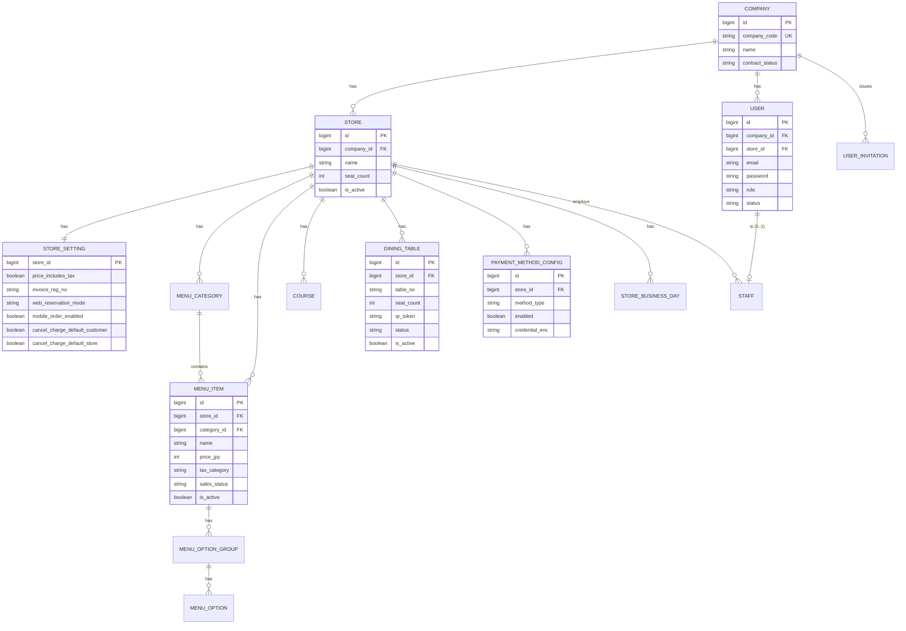

### 3.2 予約 → 来店 → 注文

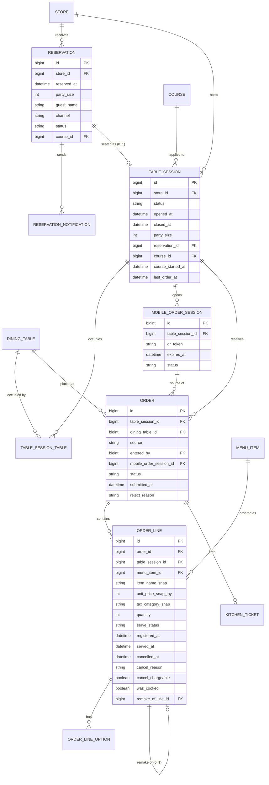

### 3.3 会計・決済・返金

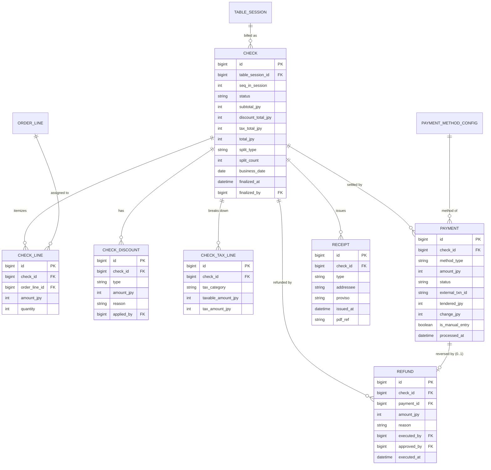

### 3.4 日次締め・売上日報・勤怠・監査

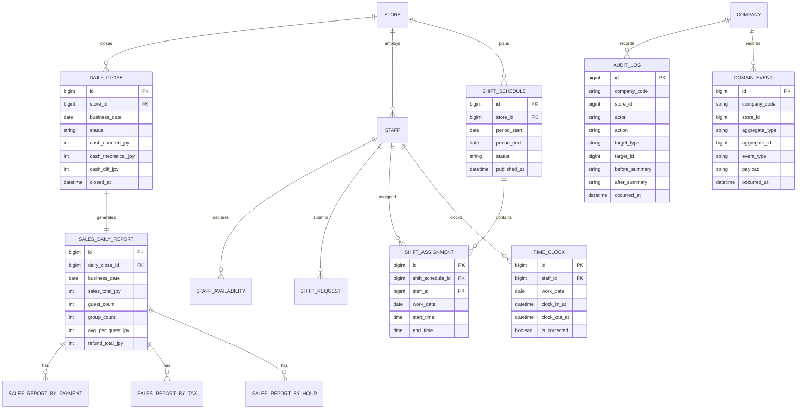

---

## 4. 主要な状態遷移（Mermaid）

### 4.1 予約 `reservation.status`

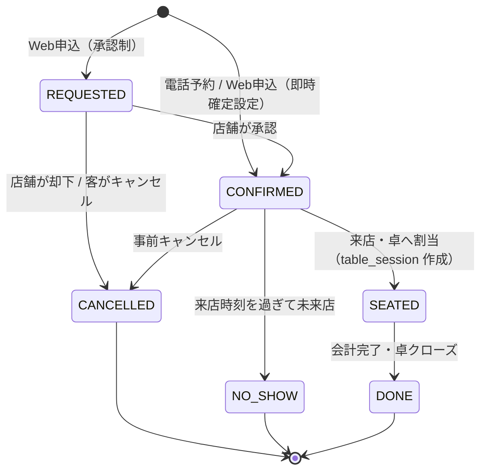

- `web_reservation_mode = INSTANT` の場合、Web申込は `CONFIRMED` で開始（FR-C06 / FR-B09）。
- `NO_SHOW` と `CANCELLED` は監査・分析のため区別して保持（FR-C09）。

### 4.2 卓セッション `table_session.status`

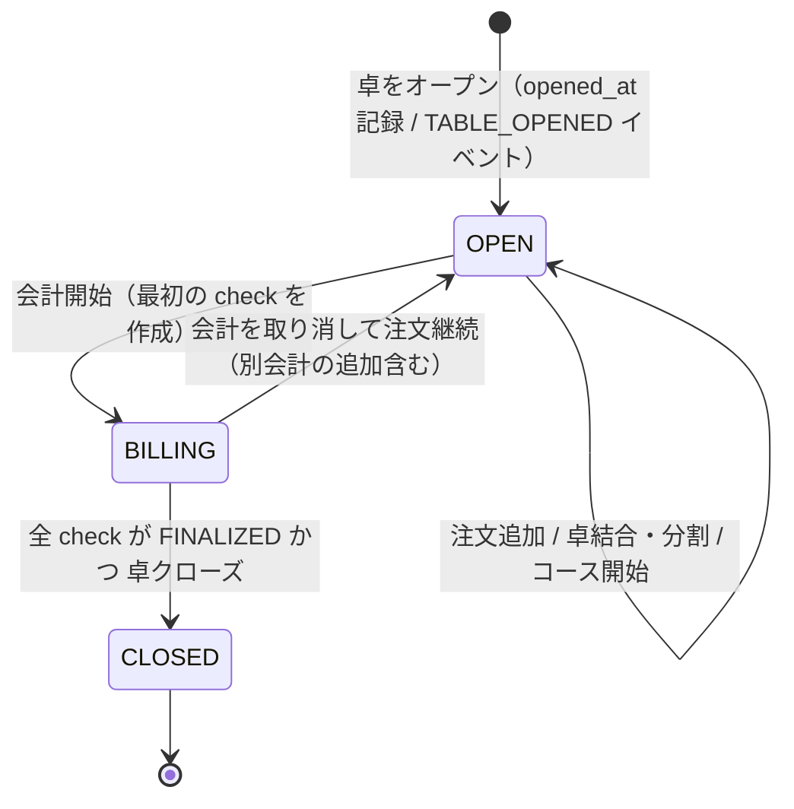

- `CLOSED` で、紐づく `mobile_order_session` は `EXPIRED` に連動（FR-F02）。
- `CLOSED` 後はこのセッションへの新規注文・会計を禁止（`domain_event: TABLE_CLOSED`）。
- 卓の `dining_table.status`（EMPTY/OCCUPIED/BILLING）は、この状態から導出して一覧表示に用いる（FR-E01）。

### 4.3 モバイルオーダーセッション `mobile_order_session.status`

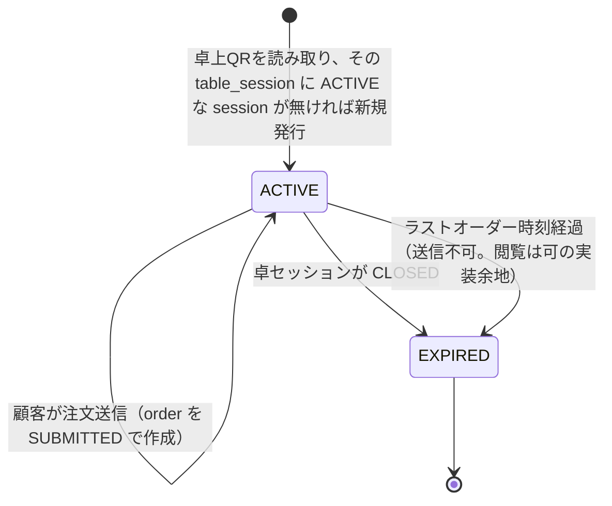

- 同一卓（同一 `table_session`）に対して同時にACTIVEな `mobile_order_session` は**常に1件**とする。QR読み取り時、
  対象 `table_session_id` に既にACTIVEな行があればそれを返し（新規行は作らない）、無ければ新規発行する。
  複数人が同じ卓で別々のスマホから読み取っても、全員が同じ `mobile_order_session_id` を共有し、同じ注文
  （カート）状態を見る形になる（客ごとの個別カート分離は行わない）。
- 卓を結合している場合も、結合先のどちらの物理卓のQRを読んでも同じ `table_session_id` に解決されるため、
  結合された卓全体で1件の `mobile_order_session` を共有する。

### 4.4 注文 `order.status`（モバイル受理フロー）

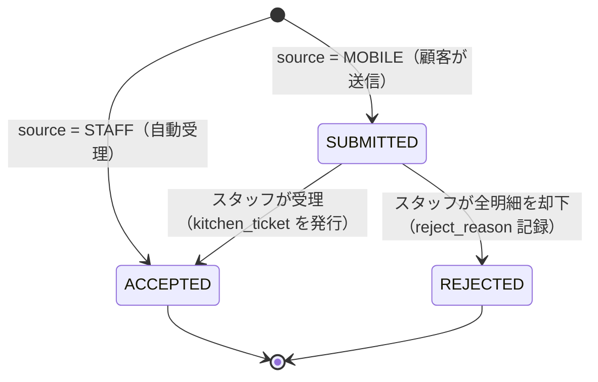

- `dining_table_id` は注文送信時点の物理卓（結合中は結合先のどの卓で入力／QR読取したか）を保持するスナップショット。
  卓の結合・分割時に、どの `order`（および配下の `order_line`）を分割後のどちらの `table_session` へ
  移送すべきかを機械的に判定するためのキーとして使う（7章・未決事項2）。

- 一部の明細のみ却下する場合は `order` は `ACCEPTED` のまま、該当 `order_line` を `REJECTED` にする（4.5）。
- `STAFF` 注文でも、キッチン未連携・調理前なら明細取消は可能（4.5）。

### 4.5 注文明細 `order_line.serve_status`

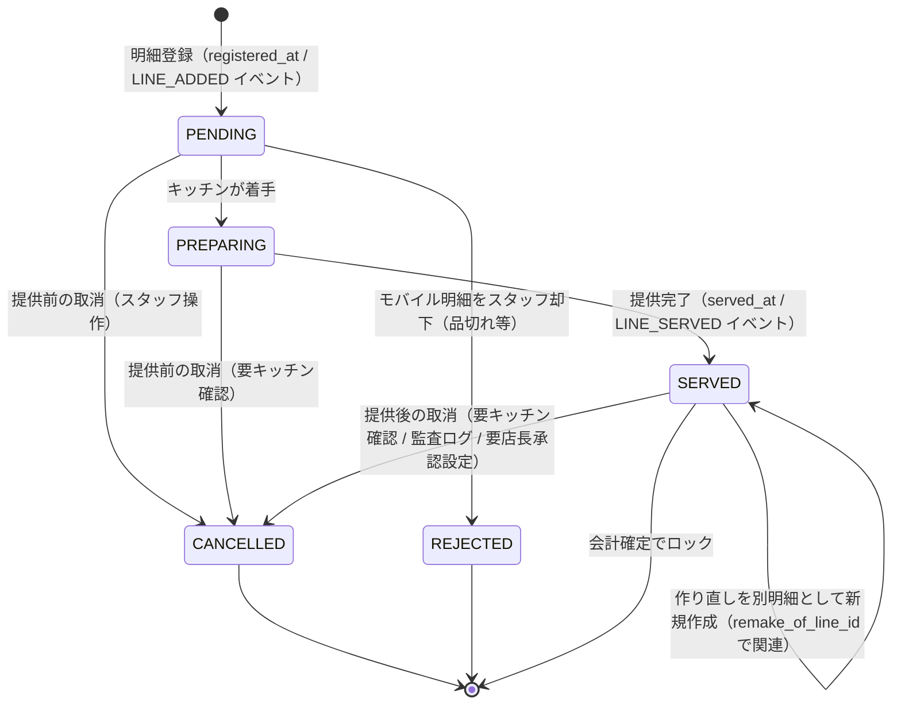

- 取消時は `cancel_reason`（ORDER_MISTAKE / QUALITY / DELAY / WRONG_SERVE / SOLD_OUT / CUSTOMER / OTHER）、
  `was_cooked`（廃棄ロス判定）、`cancel_chargeable`（`store_setting` の既定 → スタッフ上書き）を記録（FR-E03 / FR-E03b / FR-B08）。
- 「作り直し」は元明細を `CANCELLED`（理由 QUALITY 等）にしたうえで新規明細を作成し、`remake_of_line_id` で結ぶ（FR-E03c）。
- `SERVED` からの取消は `domain_event: LINE_CANCELLED` と `audit_log` の両方に記録。

### 4.6 会計 `check.status`

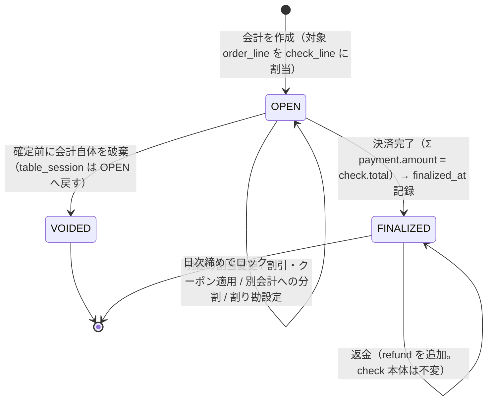

**不変条件（invariant）**
- `check.total_jpy = subtotal_jpy - discount_total_jpy + tax_total_jpy`
- `FINALIZED` の必要十分条件：`Σ payment(status=SUCCESS).amount_jpy = check.total_jpy`（混合支払い可）
- `FINALIZED` 後の金額・明細は不変。訂正は `refund`（会計確定後）または翌営業日の補正（日次締め後）。
- 1つの `order_line` は、同一 `table_session` 内でちょうど1つの `check` に割り当てられる（別会計で重複割当しない）。

### 4.7 決済 `payment.status`

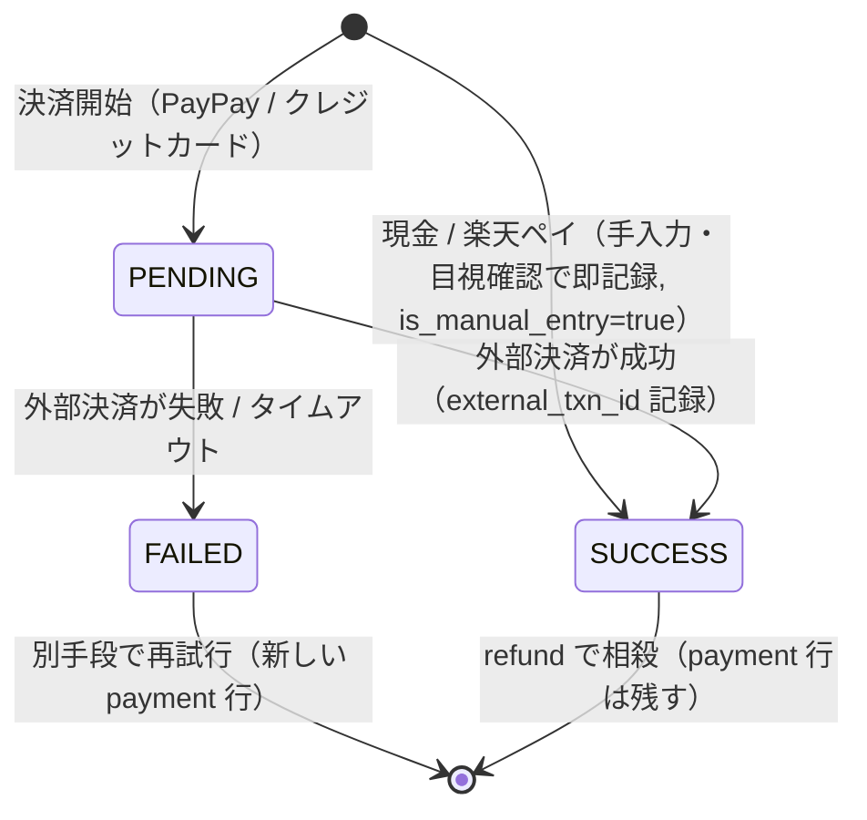

- PayPay 連携失敗時は `FAILED` を記録し、手入力（`is_manual_entry=true`）の `SUCCESS` で消し込むことを許容（FR-G06）。
- 楽天ペイ（静的QR／ストアスキャン）は常に `is_manual_entry=true`（FR-G07b）。

### 4.8 日次締め `daily_close.status`

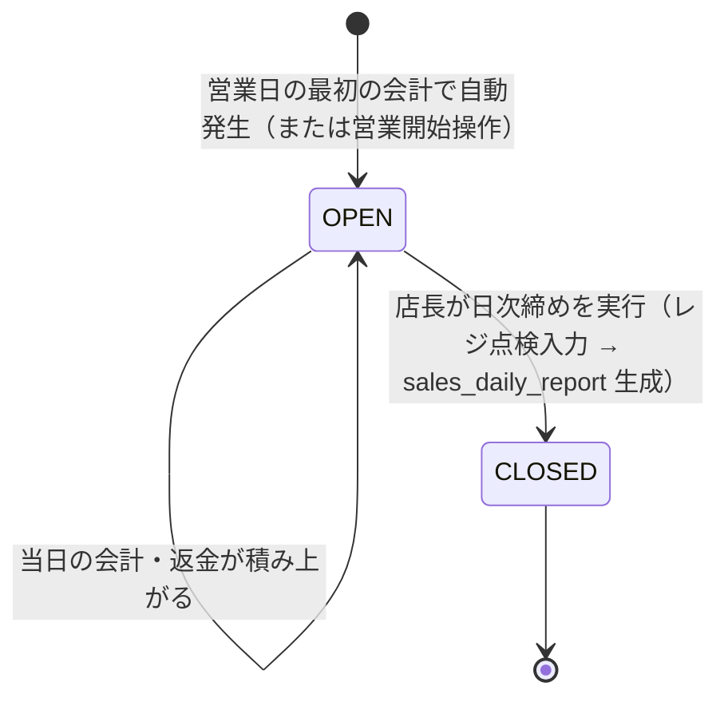

- `CLOSED` 後、その `business_date` の会計・注文明細は変更不可（FR-H01）。以降の訂正は翌営業日の補正として新規計上。
- 締め時に `sales_daily_report` と 3 つの内訳（手段別・税区分別・時間帯別）を生成（FR-H03）。

### 4.9 シフト表 `shift_schedule.status`

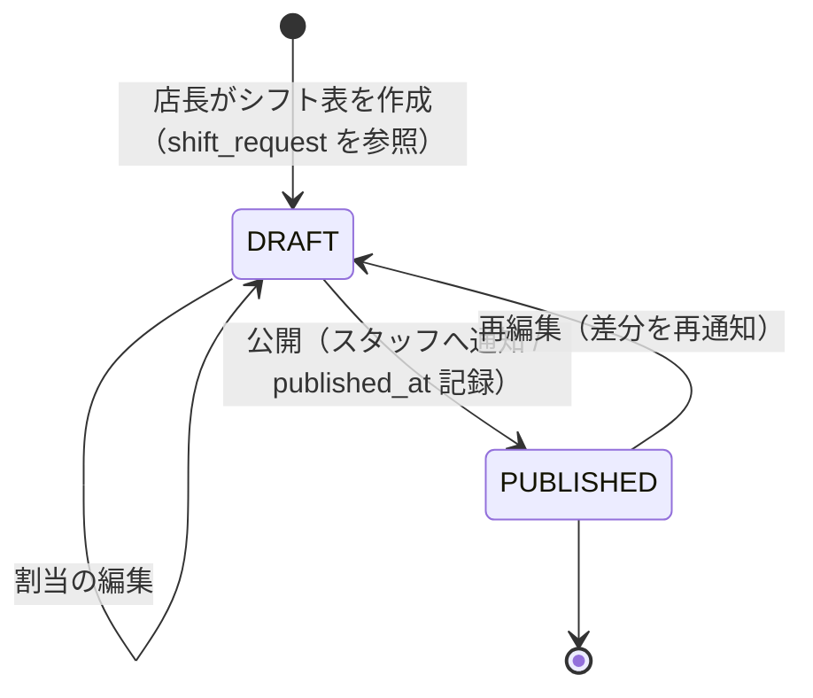

---

## 5. 主要なビジネスルール・制約（横断）

| # | ルール | 関連要件 |
|---|--------|----------|
| 1 | すべての読み書きは `company_code` でテナントを絞り込む。`store_id` でさらに店舗を絞る。 | FR-A06、NFR-09 |
| 2 | 会計画面に出せる決済手段は `payment_method_config.enabled = true` のものだけ。 | FR-G04 |
| 3 | `menu_item.sales_status` が `SOLD_OUT` / `SUSPENDED`、または時間帯・期間外の品は、スタッフ注文・モバイル注文とも登録不可。 | FR-D03、FR-F03 |
| 4 | `table_session` が `CLOSED`、または `last_order_at` 経過後は、モバイルオーダー送信不可。 | FR-F02、FR-F07 |
| 5 | モバイル注文の `order` は `ACCEPTED` になるまでキッチン連携しない。 | FR-F05、FR-F06 |
| 6 | `order_line` の `SERVED` からの取消、`check` の `VOID`、`refund`、`discount`、`daily_close`、`payment_method_config` 変更、`menu_item.price` 変更、権限変更、データエクスポートは `audit_log` に必須記録。 | FR-J01 |
| 7 | `table_session` / `order_line` / `check` / `payment` / `daily_close` の状態変化は `domain_event` に記録（分析・AI の後付け）。 | FR-K02 |
| 8 | 注文明細・会計明細は作成時点のメニュー名・単価・税区分をスナップショットし、以後マスタ変更の影響を受けない。 | FR-K01 |
| 9 | `daily_close.status = CLOSED` の営業日のデータは不変。 | FR-H01 |
| 10 | `refund` は必ず既存の `FINALIZED` な `check` に紐づき、元 `check` / `payment` は削除しない。 | FR-G10 |
| 11 | オフライン時に作成された `order` / `order_line` は復旧後に同期。競合解決規則は `04` で定義（会計・決済はオフライン不可のため対象外）。 | NFR-05、NFR-06 |
| 12 | 取消・キャンセルの課金要否は `store_setting`（客都合／店都合の既定）に従い、`order_line.cancel_chargeable` に確定値を保持。会計時にスタッフが上書き可。 | FR-B08、FR-E03 |

---

## 6. 命名・型の指針（`04` で最終化）

- テーブル名・カラム名：`snake_case`、単数形テーブル名。列は英語。
- 主キー：`id`（`bigint` / IDENTITY、既存踏襲）。外部キーは `<entity>_id`。
- 金額：整数、単位サフィックス `_jpy`。時刻：`timestamptz`（列名 `_at`）。日付：`date`（`business_date` 等）。
- 列挙（enum）：文字列で保持し、アプリ側で定数管理（DB enum 型は使わない）。本書の各状態値を初期セットとする。
- テナント／店舗列：`company_code`（`varchar(20)`、既存準拠）と `store_id` を全業務テーブルに付与。
- 監査列：`created_at` / `updated_at` は全テーブル、`created_by` / `updated_by` は業務テーブル。

---

## 7. 未決事項（`04` または実装スパイクへ）

1. ~~`company` と既存 `users`（`company_code` 文字列キー）の物理的な結合方法：`users` に `company_id` FK を足すか、`company_code` 参照のままにするか。~~
   **解決済み（`04_architecture.md` §3.1・§4.3）**：`company.id`（サロゲートキー）を主キーとし、他の全FK
   （`store_id`→`store.id` 等）と一貫させて `store`・`users`・`user_invitation` に実FKの
   `company_id BIGINT REFERENCES company(id)` を追加する。`company` 自身が `company_code`（UK）を持つため、
   `store`・`users`・`user_invitation` には `company_code` 列は一切持たせない（`users.company_code` も削除し、
   複合ユニーク制約は `company_code + email` から `company_id + email` に変更する）。登録・ログイン画面で
   利用者が入力する `company_code` は、`company` テーブルへの参照検索（`WHERE company_code = ?`）で
   `company_id` に変換してから使う。それ以外の業務テーブルの `company_code` 列は、`store_id` から
   `store.company_id` を辿れば会社を特定できるため実FKにはせず、テナント絞り込み用の非正規化コピー
   （FK制約なし）のまま維持する。
2. 卓の「結合・分割」の詳細（FR-E06 は `S`）。
   - ~~分割時にどの `order`／`order_line` を移送すべきかの判定キーが無い問題~~
     **一部解決**：`order` に `dining_table_id`（注文時点の物理卓のスナップショット）を追加。
     結合中の来店を分割する際は、分割後の各卓に対応する `dining_table_id` を持つ `order`
     （およびその配下の `order_line`）を新しい `table_session` へ付け替える、という機械的な
     移送ロジックが組める（4.4節参照）。
   - **フェーズ1方針決定**：会計開始後（`table_session.status = BILLING`、すでに `check` が
     作成された後）の卓分割は**フェーズ1では対応しない**。分割が必要な場合は、対象の `check` を
     `VOID` して `BILLING → OPEN` に戻し（4.6）、`OPEN` 状態で卓を分割してから会計をやり直す運用とする。
     `check_line` で紐づけ済みの `order_line` の付け替え、`check.total_jpy`／`check_tax_line` の
     再計算、適用済み `check_discount` の再配分、`payment` 済み・`FINALIZED` 済みケースの
     返金経路までは設計が広く波及するため、**フェーズ2以降で対応**する。
3. オフライン同期の競合解決規則（後勝ち／マージ／要確認）とクライアント側の一時ID採番。
   - **解決済み（`04_architecture.md` §1決定表3・§9）**：競合解決規則は実装しない。オフライン継続を
     「注文明細の新規追加のみ」に限定し、数量変更・取消・会計・決済はオンライン必須とすることで、
     更新競合そのものを設計上発生させる余地をなくす（追加どうしは独立しているためマージも不要）。
   - **解決済み（同 §9・§4.6）**：クライアント一時IDの形式は「端末ID（サーバがデバイス登録時に発番。
     `store` 短縮コード＋店内連番、例 `S12-07`）＋端末内でグローバルに単調増加する連番」の合成文字列
     （例 `S12-07-000123`）とし、`customer_order`・`order_line`・`order_line_option` の**各レコードの**
     `client_ref_id`（`VARCHAR(40)`）に保持する。各テーブルの `UNIQUE(..., client_ref_id)` と
     `staff_device.last_accepted_seq` で**サブツリー全階層の**冪等性を担保し（親だけでなく明細・
     オプション単位で再送を無視）、端末の再セットアップ時は端末IDを再発番して旧IDは再利用しない。
   - **解決済み（同 §9・§1決定表3）**：同期ペイロードは**フラットなレコード配列＋FK列に一時ID**の形式。
     作り直し参照は `remake_of_line_id`（同期済み明細を指す確定ID）と `remake_of_line_ref`（同一バッチ内の
     未同期明細を指す一時ID。ペイロード専用でテーブル列にはしない）に分けて持つ。バッチ内の依存順は
     **アプリ層のトポロジカルソート**で解決する（DB の `DEFERRABLE` 制約は採用しない）。
   - **解決済み（同 §9）**：同期レスポンスは、エンベロープ（`server_received_at`／`last_accepted_seq`）＋
     送信レコード**全件**に対応するフラットな `records[]` を返す。各要素は `type`／`client_ref_id`／`id`／
     `status`（`INSERTED`／`DUPLICATE`／`REJECTED`）／任意の `server_fields`・`error`。再送しても
     各 `client_ref_id` に同じ `id` を返す。
   - **解決済み（同 §9）**：クライアント側の一時ID↔確定ID対応表は、対象レコードが属する `table_session`
     が `CLOSED` になるまでローカル保持し、以後そのセッション分を破棄する（`CLOSED` を長期間観測できない
     場合の固定TTLをバックストップに置く）。サーバ側は `client_ref_id` 列を §10 の保持期間まで永続保持
     するため、これはクライアント端末のローカルコピーの寿命のみを定める。
   - **解決済み（同 §9）**：部分失敗はハイブリッドで扱う。サブツリー前提の検証（親 `customer_order`・
     対象 `table_session` の受付可否・構造整合性）は all-or-nothing で、落ちたら木ごとロールバックし
     全配下を `SKIPPED`。個々の `order_line`／`order_line_option` の業務検証は部分コミットで、落ちた明細は
     `REJECTED`＋`error.code`（`SOLD_OUT` 等の初期セット）、その配下オプションは `SKIPPED` で返す。
     リトライ可否は明示フィールドを置かず、`error.code` 付き `REJECTED` ＝永続的失敗（自動再送せず
     スタッフへエスカレーション）、一時的失敗は 5xx／タイムアウト等のトランスポート層で判定して
     バッチ全体を指数バックオフ再送、と切り分ける。残り（却下＝提供済み料理の監査／廃棄ロス連携、
     HTTP ステータス規約）は実装スパイクで確定。
   - **解決済み（`04_architecture.md` §9・§1決定表3）**：遅延同期が `CLOSED` の `table_session`／
     `FINALIZED` の `check` に着地した場合、フェーズ1では同期APIが `SESSION_CLOSED` で `REJECTED` を
     返し、拒否された明細は**業務的に回収しない**。`check` への明細追加・補助会計・`refund` 等の金銭
     リカバリは行わず、**回収不能＝廃棄ロス／サービス提供分**として `domain_event`（監査）に記録する
     のみとする。売上計上・追加請求はせず、代金回収経路（追加請求・翌営業日補正）の整備はフェーズ2
     以降とする。
   - **解決済み（`04_architecture.md` §9・§1決定表3）**：オフライン中に許可するのは**新規レコードの
     作成のみ**。すでにサーバへ永続化済みの行（オンラインで作成された `order_line` 等、`client_ref_id`
     を持たない行）への更新は、`serve_status` の `PENDING → SERVED` 変更を含め**オフラインでは一切
     不可**とする。`updated_at`／専用 `version` 列を初期表示時にクライアント保持し復帰時にサーバ現在値と
     突き合わせる**楽観的ロックでの解禁は採用しない**（長時間オフラインでは版の不一致が高頻度で発生し、
     エラー後の手動照合がかえって増えるため）。こうした更新はオンライン復帰後に行う（アプリがオフライン
     時に当該操作を抑止するか、意図をローカルキューへ退避して復帰後に通常のオンライン更新として再生する）。
     なお、オフラインで新規作成された明細が初回同期時に自前の `serve_status`／`served_at` を初期値として
     持ち込めるか（＝提供済みオフライン明細の `kitchen_ticket` 抑止に使えるか）は下記の未解決事項に含む。
   - 未解決のまま：
     - オフライン許容時間の上限（端末が何時間オフラインのまま新規注文を受け付けてよいか。上限到達時に
       読み取り専用へ落とすか否か、`daily_close` の境界・一時ID対応表の固定TTLとの整合）。
     - オフライン中の端末時計の信頼性（`registered_at`・`business_date`・KDS表示順をどの時刻で決めるか）。
     - 遅延同期時の `kitchen_ticket` 抑止（提供済みオフライン明細で KDS を鳴らさない）。
     - スナップショットの鮮度（オフライン中は端末保持のメニューで確定。マスタがその間に変わっていた
       場合の扱いの明文化）。
4. `domain_event` の粒度と保持・アーカイブ方針（件数が多い。パーティション／コールドストレージ）。
5. モバイルオーダーの `qr_token` の設計：卓固定トークン＋セッション毎の短命トークンの2層にするか。失効・再発行の運用。
6. 税計算の丸め（会計単位／明細単位）、端数調整（`ROUNDING` ディスカウント）の扱い。
7. `receipt` の適格請求書レイアウトと PDF 生成方式（サーバ生成／テンプレート）。
8. `staff` と `user` の一体化度合い（打刻のみの非ログインスタッフを許容するか）。
9. 売上日報の「客数」「組数」の定義（`table_session.party_size` の合計／`table_session` 件数）。
10. `menu_option_*`・`course` をフェーズ1に含めるか（現状 `S`）。含めない場合、`order_line.note` で代替。
11. （フェーズ2構想）顧客の会員登録・テナント単位でのログイン・過去の予約履歴閲覧。
    `guest`（顧客）エンティティを新設し、`user`（スタッフ）とは別の認証経路とする想定
    （`company_code + email` の複合UKなど、命名・分離方針は `user` に準拠しつつ検討）。
    `reservation` には `guest_id`（nullable, FK→`guest`）を追加し、匿名予約（フェーズ1の
    `guest_name`/`guest_phone`/`guest_email`）とログイン済み顧客の予約を共存させる。

---

## 8. 次のステップ

1. 本書のレビュー（エンティティの過不足、状態値の妥当性、不変条件の合意）。
2. `04_architecture.md`：物理スキーマ（DDL 方針）、API 一覧、テナント分離の実装（アプリ層強制／RLS の要否）、
   決済連携の詳細、`domain_event` の実装方式、Mermaid 図の PDF レンダリング方針、データ保持期間の確定値。
3. フェーズ1バックログ化：エンティティ単位の CRUD と、状態遷移をまたぐユースケース（来店〜会計〜締め）を
   ストーリー分解し、`02` の FR ID と対応付ける。
